# Benchmarks for Functions for the Triangular Distribution in R

**NOTE**: Functions from [distr6](https://alan-turing-institute.github.io/distr6/) and [tfprobability](https://rstudio.github.io/tfprobability/) packages will not be included as they do not work without requiring a distribution object.

## Methodology

I used [bench](https://bench.r-lib.org/) for speed and memory benchmarking. The bench package is preferred as it provides a number of advantages over other alternatives, such as tracking of memory allocation and number of garbage collections. More info: [bench.r-lib.org](https://bench.r-lib.org/)

## Environment

R 4.0.2

Package                                                     | Version
----------------------------------------------------------- | --------
[EnvStats](https://www.probstatinfo.com/)                   | 2.3.1
[extraDistr](https://github.com/twolodzko/extraDistr)       | 1.9.1
[fitODBOD](https://amalan-constat.github.io/R-fitODBOD/)    | 1.4.1-1
[jmuOutlier](https://CRAN.R-project.org/package=jmuOutlier) | 2.2
[mc2d](https://cran.r-project.org/package=mc2d)             | 0.1-18
[metRology](https://cran.r-project.org/package=metRology)   | 0.9-28-1
[OOmisc](https://cran.r-project.org/package=OOmisc)         | 1.2
[propagate](https://cran.r-project.org/package=propagate)   | 1.0-6
[Runuran](https://statmath.wu.ac.at/unuran/)                | 0.30
[triangle](https://bertcarnell.github.io/triangle/)         | 0.12
[triangulr](https://irkaal.github.io/triangulr/)            | 1.0.1
[VaRES](https://cran.r-project.org/package=VaRES)           | 1.0
[VGAM](https://www.stat.auckland.ac.nz/~yee/VGAM/)          | 1.1-3

Component |	Value
--------- | -----
CPU Model | AMD Ryzen 5 3600 @ 3.6 Ghz
CPU Cores | 6
RAM Model | DIMM Synchronous 3200 MHz
RAM GB    | 16

## Density Functions

### 100K Quantiles

### 1M Quantiles
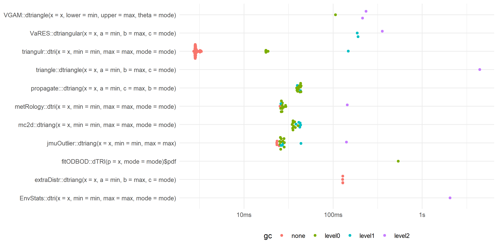

### 10M Quantiles
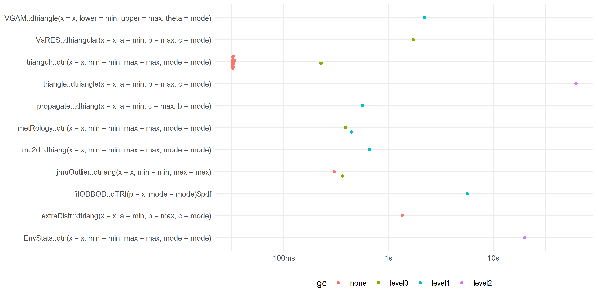

### Median Time
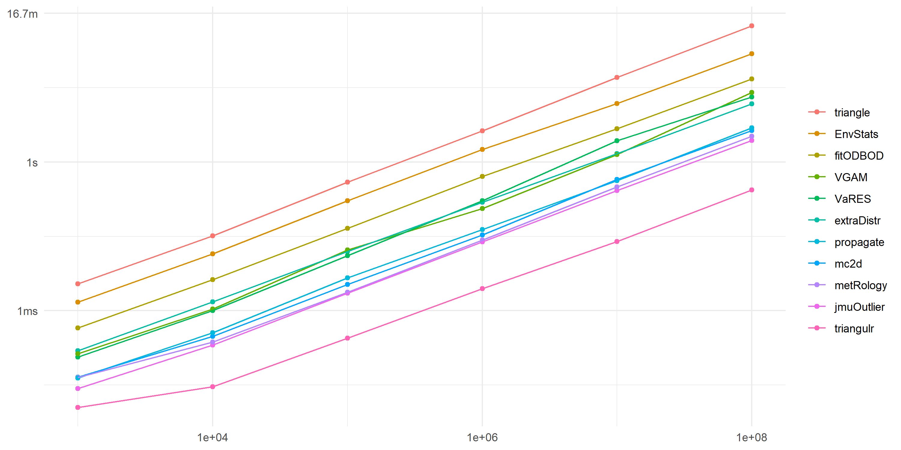

### Memory
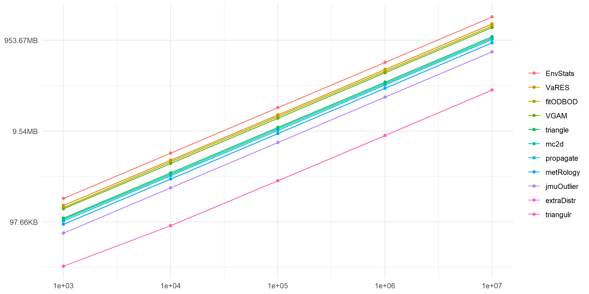

## Distribution Functions

### 100K Quantiles
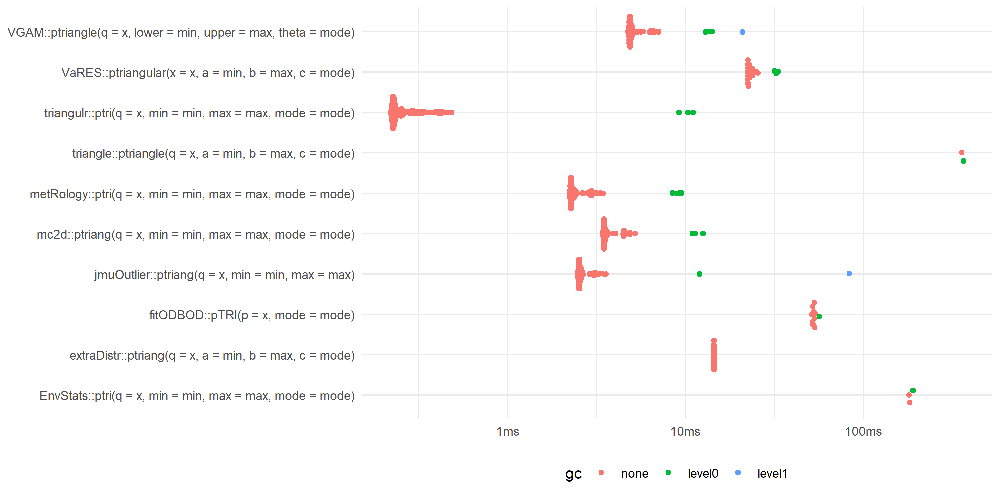

### 1M Quantiles
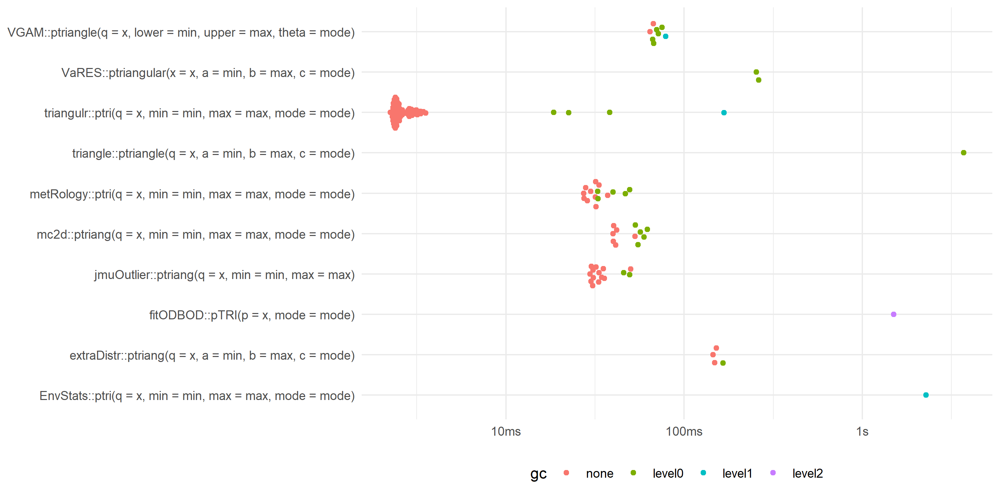

### 10M Quantiles
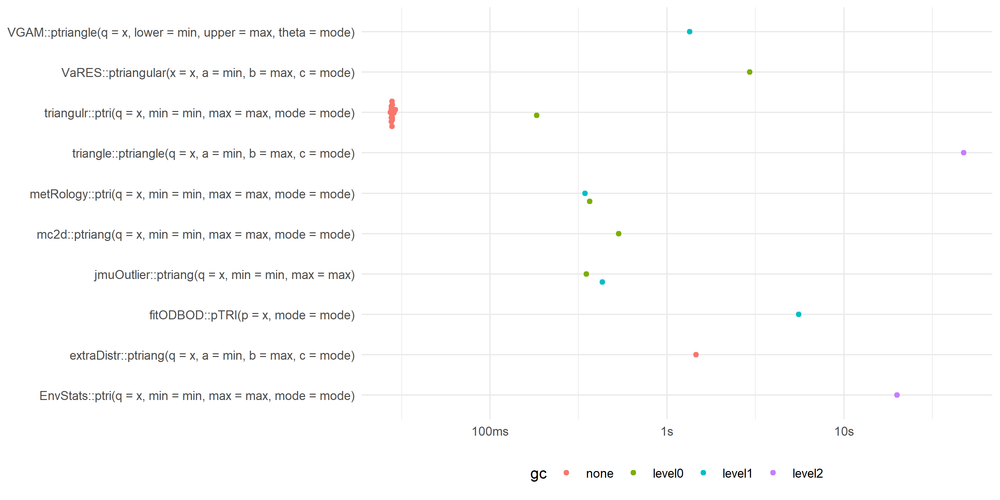

### Median Time
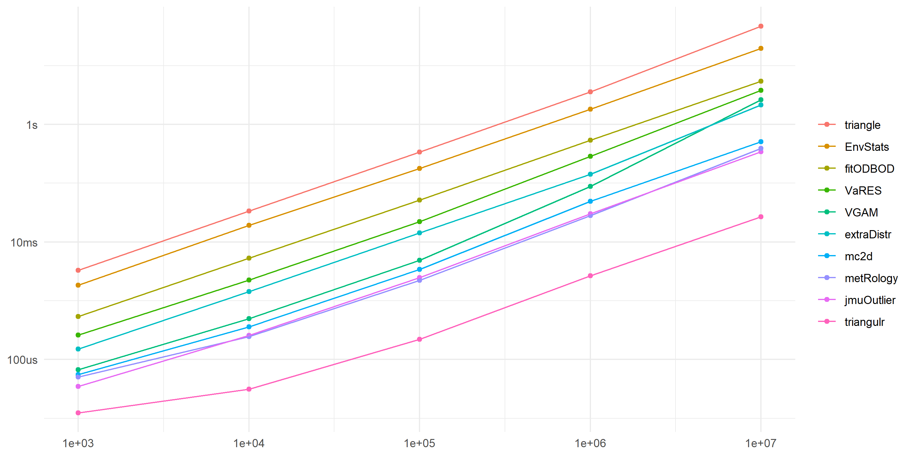

### Memory Allocation
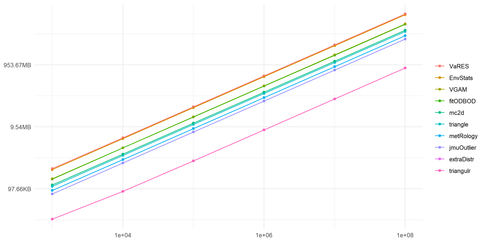

## Quantile Functions

### 100K Probabilities
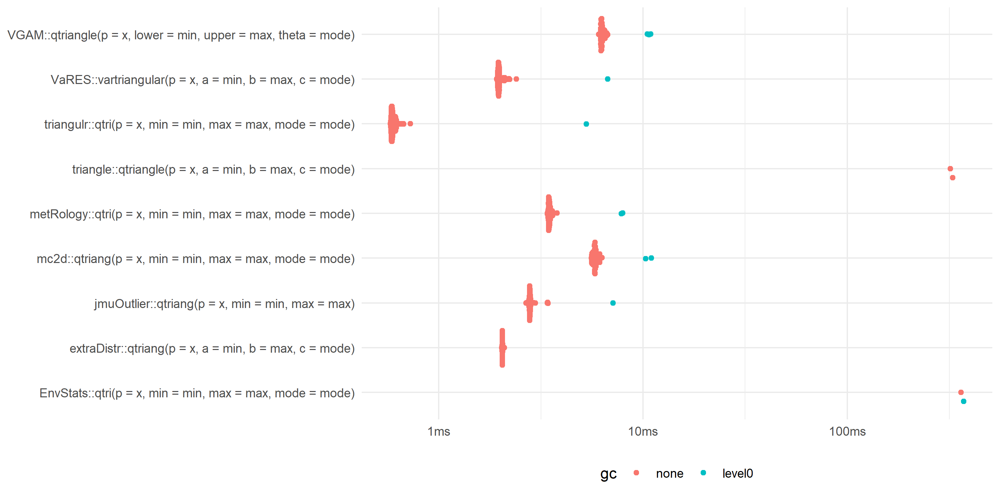

### 1M Probabilities
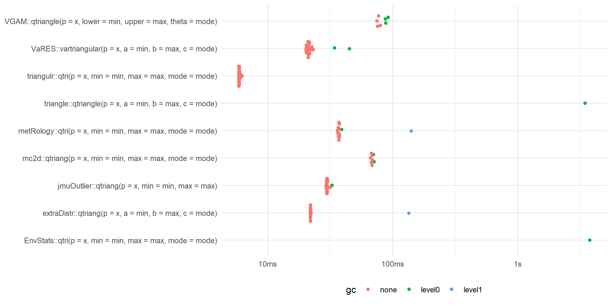

### 10M Probabilities
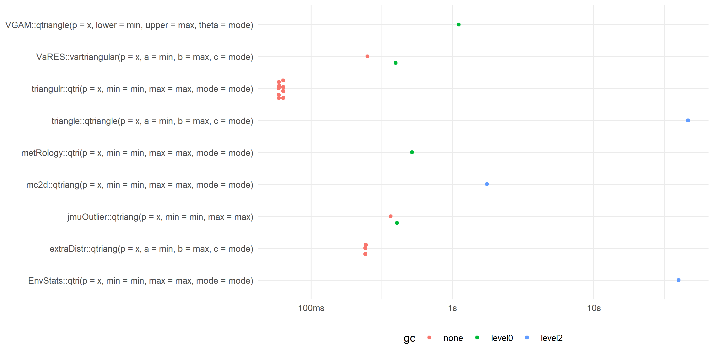

### Median Time

### Memory Allocation
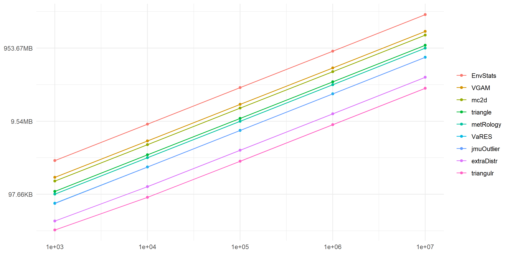

## Random Variate Generator Functions

### 100K Random Variates
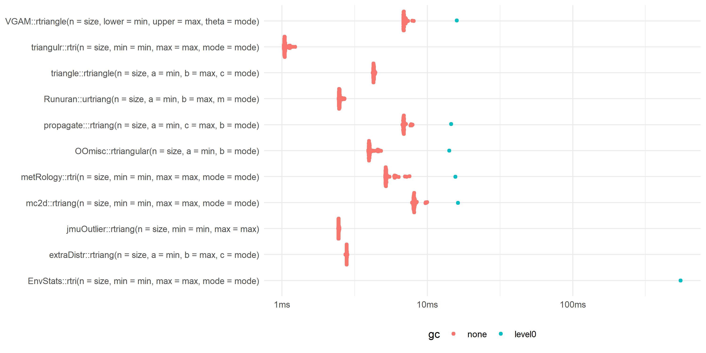

### 1M Random Variates

### 10M Random Variates
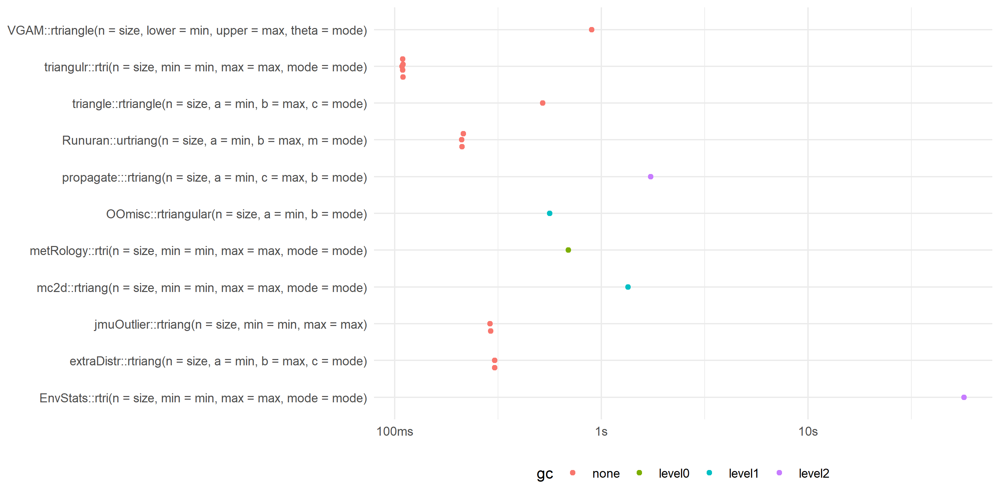

### Median Time
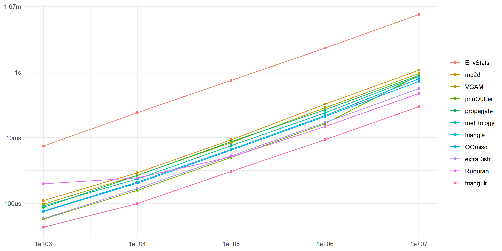

### Memory Allocation
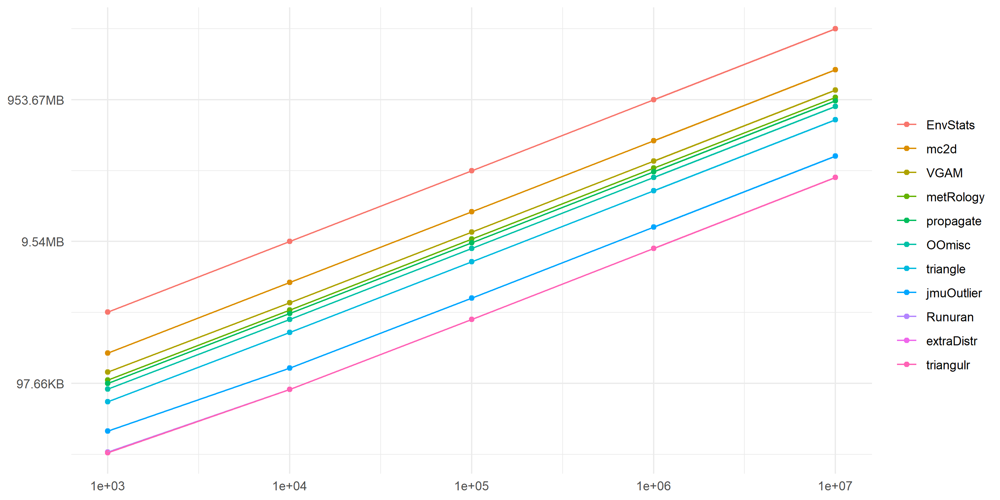

## Expected Shortfall Functions

### 100K Probabilities
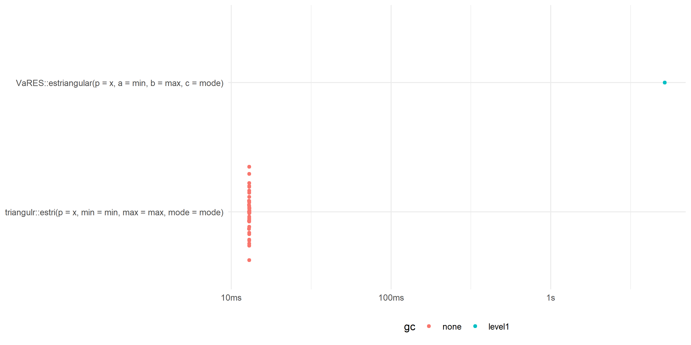

### Median Time
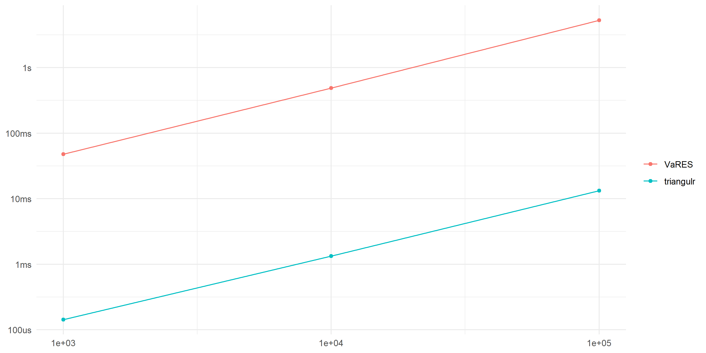

### Memory Allocation
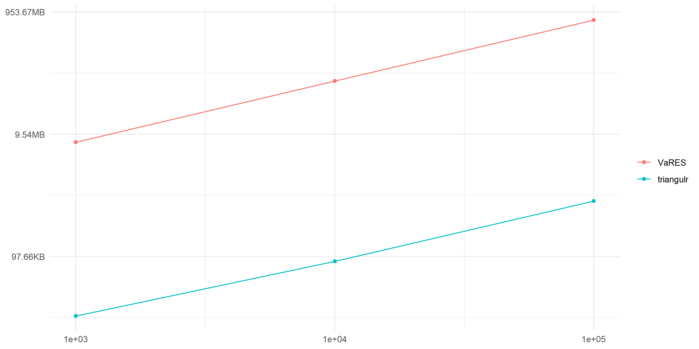
